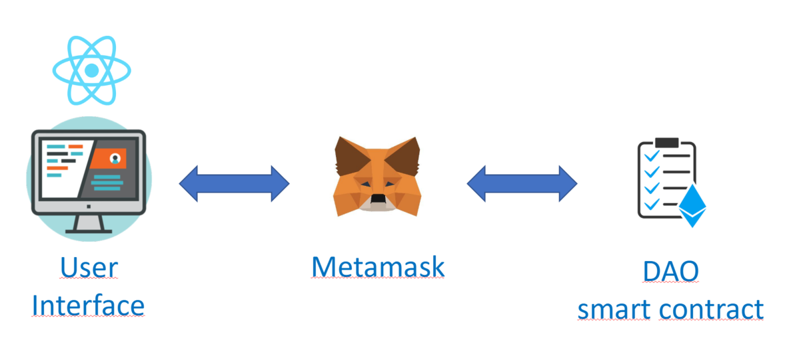
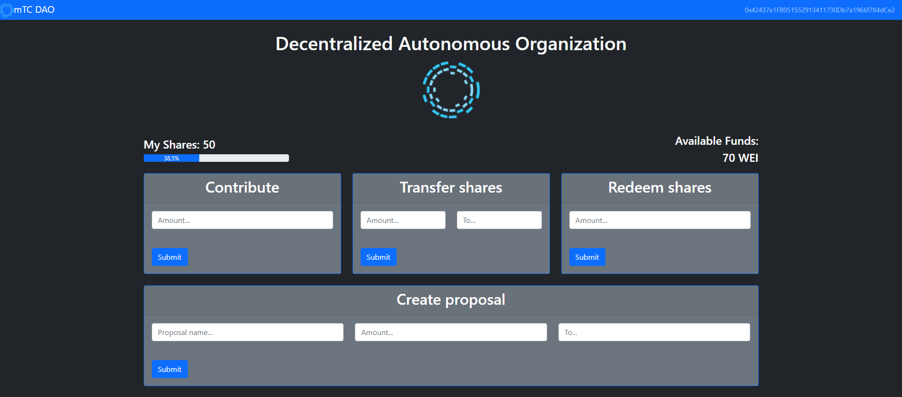
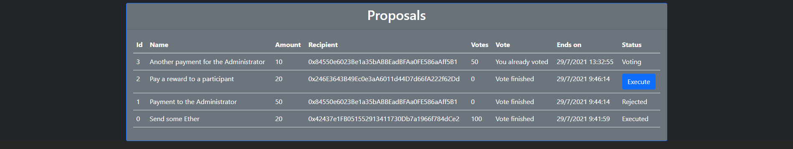

`#Ethereum`

# mTC DAO

This is a Decentralized Autonomous Organization which allows the end users to participate by buying shares, which will give them the ability to create proposals, vote and execute them.

## Table of Contents

- [Getting Started](#getting-started)
- [The Project](#the-project)
- [Resources](#resources)

## Getting Started

These instructions will get you a copy of the project up and running on your local machine for development and testing purposes.

### The repository

First, you will need to `clone` or `fork` the repository into your Github account:


```
$ git clone https://github.com/miquelTC/decentralized-autonomous-organization.git
```

### Installing

First, you will need to install the dependencies with: `npm install`.

Run the following command in your terminal after cloning the main repo:

```
$ npm install
```

Then, you will need to install Truffle globally by running the following command int your terminal:

```
$ npm install -g truffle
```

### Running the Tests

First, you will have to compile the smart contracts by running the following command in your terminal:

```
$ truffle compile
```

Then you will have to install and run Ganache to run your blockchain locally:

https://www.trufflesuite.com/ganache

Then, the tests that validate your solution can be executed by runing the following
command:

```
$ truffle test
```

### Deployment on Local Blockchain

Deploy the contracts on your Ganache local blockchain by running the following command:

```
$ truffle migrate
```

### Opening the User Interface

First of all, it is required to install Metamask wallet as a browser extension: https://metamask.io/

Then you should configure Metamask to connect to your local blockchain run by Ganache. This requires the following:
- Open Metamask
- Open the Network Configuration panel
- Open Custom RPC
- Configure your private network by adding `http://localhost:7545` on the URL and `1337` as a chain ID.
- Import the first Ganache Account to Metamask by copying the Account Private Key from Ganache and pasting it on Metamask

Finally you just need to run the following command in your terminal to open the User Interface:

```
$ npm start
```

### Deployment on Public Network

In order to deploy your smart contract, you must create your .env file and specify:

- `PRIVATE_KEYS` --> Private Key of the account you are using to deploy (typically the first one in the list of Ganache)
- `INFURA_API_KEY` --> API key provided by Infura: https://infura.io

Then, you will need to run the following command (let's use the testnet Ropsten in this example, remember to request some Ether for your account using a faucet):

```
$ truffle migrate --network ropsten
```

Finally you can run the following command to generate the build artifacts of your User Interface and then deploy to your favourite host:

```
npm run build
```


### Technology stack

- `Solidity`
- `React.js`
- `Truffle`
- `Web3.js`
- `Ganache`
- `Node.js`
- `Metamask`

## The Project

This project consists in a Decentralized Autonomous Organization to handle payments. The user will acquire shares by depositing Ether to the organization. These shares will allo this use to do the following:

- Create Proposals to send a determined amount of Ether to a particular Ethereum address.
- Vote on existing proposals (the more shares the user has, the more voting power).

 The components of this project are:

- A smart contract which represents the DAO itself, tracking proposals, votes, proposal execution...
- Tests built with JavaScripts to ensure smart contracts are accomplishing the expected functionalities
- A React.js front-end application as a user interface

### Project architecture



The user can access the application via web-browser, and he must have the Metamask wallet installed. This interface, built with React.js, relies on the web3.js library to communicate with the smart contracts through Metamask. This means that the data reflected on the front-end application is fetched from the Ethereum blockchain. Each action performed by the user (create a proposal, vote...) creates a transaction on Ethereum, which will require Metamask confirmation and pay an small fee, and this transaction will permanently modify the state of the DAO smart contract.

### DAO features




First of all some key concepts about this DAO:

#### Shares

They represent the rights to participate in this autonomous organization, allowing the end user to create a proposal and vote on existing proposals.

#### Proposal

A proposal gives us the option od sending a determined amount of Ether to a particular user. Once a proposal is created, there is a certain amount of time to vote on it, and if votes ar higher than a determined quorum, then it can be executed, otherwise it can be rejected.

#### Available Funds

All the Ether collected by the DAO represent the Available Funds. These are the funds which can be used to transfer to some addresses via proposal.

### DAO user actions

The user can basically execute the following actions in this DApp:

#### Contribute

This action will require exchange a certain amount of Ether by Shares, which is a must to participate in this DAO. These shares will allow the user to create a proposal to send a certain amount of Ether to a determined user, and also to vote on existing proposals. The voting power is determined by the amount of shares the user possesses, meaning the more amount of shares, the more voting power.

#### Transfer shares

The investor can send his shares to someone else.

#### Redeem shares

If there are enough Available Funds, the investor can redeem some shares by getting back his Ether and losing his Shares.

#### Create Proposal

Investors are allowed to make a proposal and define the amount of Ether and the recipient.

#### Vote

Investors can vote on existing proposals if they agree with it. The more shares the user possesses, the more voting power he has. There is a determined amount of time to vote (defined when the smart contract is deployed).

#### Execute

Anyone can execute a proposal. Once the voting period is over, anyone can click on the button and the proposal gets either Executed (if sufficient votes) or rejected (if not sufficient votes). This way we keep the organization as much decentralized as possible.

#### Withdraw Ether

Only the admin will have powers to withdraw Ether from the Available Funds and send it to any Ethereum address.


## Resources

- [ethereum.org](https://ethereum.org/)
- [truffle suit](https://www.trufflesuite.com/)
- [node.js](https://nodejs.org/)
- [web3.js](https://web3js.readthedocs.io/)
- [react.js](https://reactjs.org/)